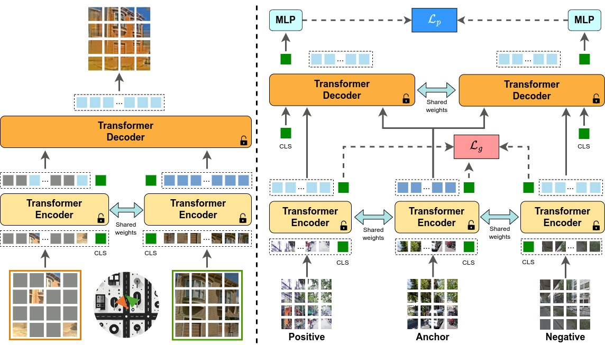
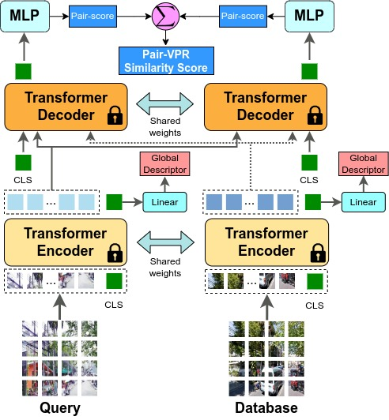
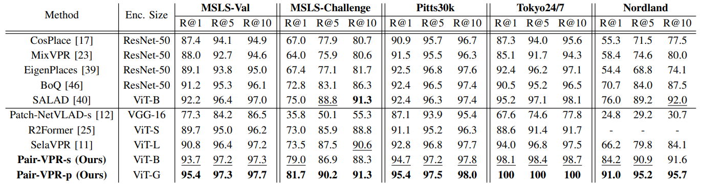
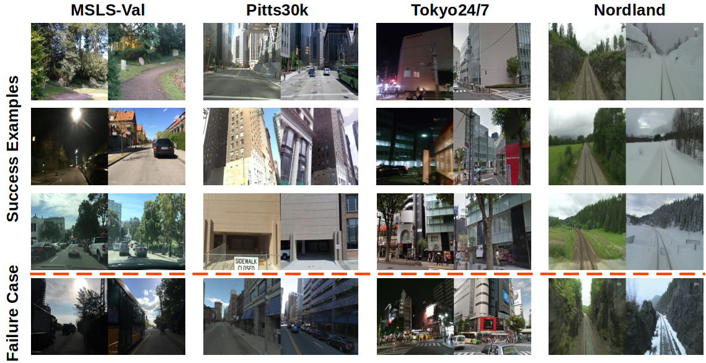

## Pair-VPR: Place-Aware Pre-training and Contrastive Pair Classification for Visual Place Recognition with Vision Transformers
      

### Abstract

In this work we propose a novel joint training method for Visual Place Recognition (VPR), which simultaneously learns a global descriptor and a pair classifier for re-ranking. The pair classifier can predict whether a given pair of images are from the same place or not. The network only comprises Vision Transformer components for both the encoder and the pair classifier, and both components are trained using their respective class tokens. In existing VPR methods, typically the network is initialized using pre-trained weights from a generic image dataset such as ImageNet. In this work we propose an alternative pre-training strategy, by using Siamese Masked Image Modelling as a pre-training task. We propose a Place-aware image sampling procedure from a collection of large VPR datasets for pre-training our model, to learn visual features tuned specifically for VPR. By re-using the Mask Image Modelling encoder and decoder weights in the second stage of training, Pair-VPR can achieve state-of-the-art VPR performance across five benchmark datasets with a ViT-B encoder, along with further improvements in localization recall with larger encoders.

### Method Overview
Pair-VPR uses global descriptor database searching to generate a list of top candidates, then uses a pair classifier to estimate which is the best matching database image given a query image. Pair-VPR is trained in two stages as shown below.

Left side: During Stage 1 of training, we train a ViT encoder and decoder using siamese mask image modelling with Place-aware sampling from large scale and diverse VPR datasets. Right: in Stage 2, we re-use both the pre-trained encoder and decoder and train specifically for the VPR task, jointly learning a global descriptor and a pair classifier.

#### Pair-VPR Inference
After training Pair-VPR, it can be used to first generate global descriptors for every image, then for a list of top database candidates, the top candidates can be re-ranked using Pair-VPR. A diagram of this process is shown below. 

Given a query and database image, encoded features are passed into the transformer decoder (twice, in alternating input orders), and the transformer decoder outputs a similarity score from the output of a class token. The two similarity scores are summed to produce the final Pair-VPR similarity score for a given pair. In practise, for enhanced computational efficiency Pair-VPR can be run in a batch where a batch is a tensor of (query, database) pairs. Then all re-ranking can be performed using a single forward pass through the Pair-VPR decoder.

### Results
We provide two variants of Pair-VPR: a performance version (Pair-VPR-p) and a speed version (Pair-VPR-s). The performance version has more top candidates and uses a ViT-G encoder. Both models achieve the highest Recall@1 result on the five benchmark VPR datasets, and the performance version is useful when accurate VPR is essential. The speed version allows for VPR retrieval with under 1 second latency.   

#### Qualitative Results
We show some qualitative results from Pair-VPR, using the speed version. We provide three success examples and one failure case per dataset, showing that Pair-VPR can operate even when there is severe viewpoint shift, seasonal changes or at night.

### Github Code
 

    We will provide the code for Pair-VPR <a href="https://github.com/csiro-robotics/Pair-VPR">in our GitHub repository</a>. Code will be released soon, please Star or Watch this repository to be notified when we release the code.

### Paper

The pre-print version of the paper is available on arxiv at:

            
            
<a href="https://arxiv.org/abs/2410.06614"><strong>Pre-print of our paper: "Pair-VPR: Place-Aware Pre-training and Contrastive Pair Classification for Visual Place Recognition with Vision Transformers"</strong></a>

### Citation

If you find this paper helpful for your research, please cite our paper using the following reference:

<pre><code class="citation">
@inproceedings{hausler2024pairvpr,
  title = {Pair-VPR: Place-Aware Pre-training and Contrastive Pair Classification for Visual Place Recognition with Vision Transformers},
  shorttitle = {Pair-VPR},
  doi = {https://doi.org/10.48550/arXiv.2410.06614},
  booktitle = {Arxiv},
  author = {Hausler, Stephen and Moghadam, Peyman},
  month = Oct,
  year = {2024}
}
</code></pre>

